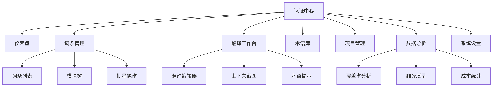
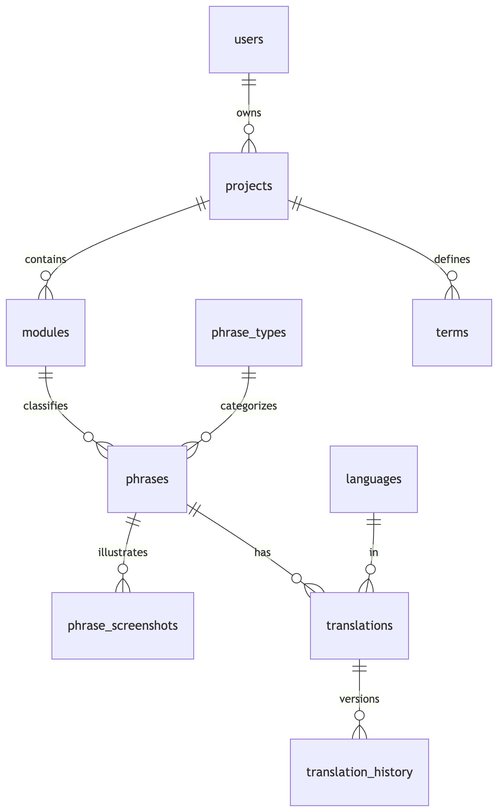
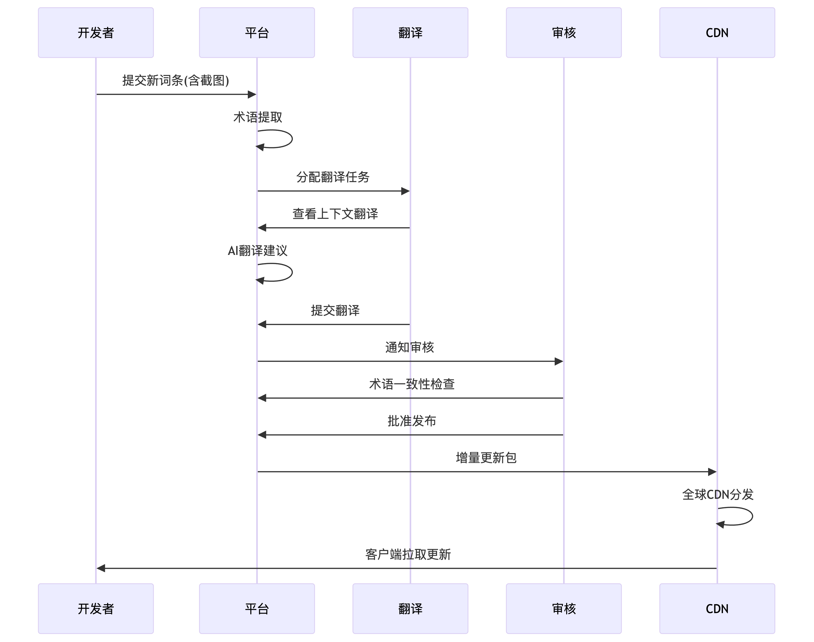
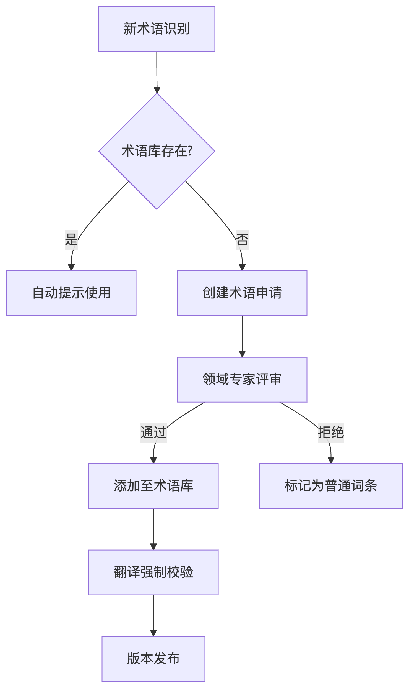

# 国际化管理平台设计方案

## 一、项目背景

### 全球化挑战
随着企业产品全球化进程加速，面临核心挑战：
- 多语言版本更新滞后，上线周期长达2-4周
- 各端(Web/iOS/Android/后端)翻译不一致率超30%
- 术语不统一导致用户困惑，品牌形象受损
- 缺乏上下文导致翻译准确率不足70%
- 协作效率低，翻译返工率超40%

### 平台目标
构建统一国际化管理平台，实现：
1. 多端词条集中管理
2. 翻译-审核-发布全流程自动化
3. 术语统一与上下文可视化
4. 实时多语言更新分发
5. 数据驱动的翻译优化

## 二、技术选型

### 前端技术栈

| 模块 | 技术方案 | 优势 |
|------|----------|------|
| 框架 | Vue3 + Vite | 响应式开发，极致构建速度 |
| 状态 | Pinia | 轻量状态管理，TypeScript支持 |
| UI库 | Naive UI | 灵活组件，主题定制能力强 |
| 路由 | Vue Router | 动态路由，布局系统 |
| 请求 | Axios | 拦截器，CSRF防护 |
| 权限 | Casbin + ABAC | 细粒度动态权限控制 |
| 可视化 | ECharts | 丰富图表，数据洞察 |

### 后端技术栈

| 模块 | 技术方案 | 优势 |
|------|----------|------|
| 框架 | Rust | 极高的性能与速度类型安全 |
| WEB框架 | Axum | 异步web框架高性能 |
| ORM框架 | Diesel | rust生态最火的orm框架 |
| 数据库 | MySQL | 8.0	JSON支持，窗口函数 |
| 缓存 | Redis | 高频词条缓存，发布队列 |
| 存储 | MinIO | S3兼容，截图存储 |
| 任务 | Kafka | 分布式翻译任务队列 |
| 部署 | Docker+K8s	| 弹性伸缩，滚动更新 |

### 多端SDK

| 平台 | 技术方案 | 特点 |
|------|----------|------|
| Web | Vue插件 | 按需加载，<15KB |
| iOS | Swift库 | 离线优先，<50KB |
| Android | Kotlin库 | 协程支持，<60KB |
| Flutter | Dart插件 | 多平台共享，<40KB |
| 后端 | Rust/Java包 | 多语言支持 |

## 三、前端设计方案
### 核心模块架构


### 关键页面设计
1. 翻译工作台（核心界面）


2. 词条管理
- 多维度筛选（类型/状态/平台）
- 批量导入/导出（Excel/XLIFF）
- 词条对比工具（版本差异）
- 截图关联管理

## 四、数据库设计
### 核心表关系


### 表结构
```
-- 用户表
CREATE TABLE i18n_users (
    id BIGINT UNSIGNED AUTO_INCREMENT PRIMARY KEY,
    username VARCHAR(50) NOT NULL UNIQUE,
    password VARCHAR(255) NOT NULL,
    email VARCHAR(100) NOT NULL UNIQUE,
    realname VARCHAR(50) NOT NULL,
    avatar VARCHAR(255) DEFAULT NULL,
    status TINYINT(1) NOT NULL DEFAULT 1 COMMENT '0:禁用,1:启用',
    last_login DATETIME DEFAULT NULL,
    crt_by BIGINT UNSIGNED COMMENT '创建人',
    crt_at TIMESTAMP DEFAULT CURRENT_TIMESTAMP,
    upt_by BIGINT UNSIGNED COMMENT '更新人',
    upt_at TIMESTAMP DEFAULT CURRENT_TIMESTAMP ON UPDATE CURRENT_TIMESTAMP,
    INDEX idx_users_email (email),
    INDEX idx_users_status (status)
) ENGINE=InnoDB DEFAULT CHARSET=utf8mb4;

-- 项目表
CREATE TABLE i18n_projects (
    id INT UNSIGNED AUTO_INCREMENT PRIMARY KEY,
    name VARCHAR(100) NOT NULL UNIQUE,
    description TEXT,
    base_language CHAR(5) NOT NULL COMMENT '基础语言代码',
    owner_id BIGINT UNSIGNED NOT NULL,
    status TINYINT(1) NOT NULL DEFAULT 1 COMMENT '0:停用,1:启用',
    crt_by BIGINT UNSIGNED NOT NULL,
    crt_at TIMESTAMP DEFAULT CURRENT_TIMESTAMP,
    upt_by BIGINT UNSIGNED,
    upt_at TIMESTAMP DEFAULT CURRENT_TIMESTAMP ON UPDATE CURRENT_TIMESTAMP,
    INDEX idx_projects_name (name),
    INDEX idx_projects_owner (owner_id)
) ENGINE=InnoDB DEFAULT CHARSET=utf8mb4;

-- 语言表
CREATE TABLE i18n_languages (
    code CHAR(5) PRIMARY KEY COMMENT 'ISO 639-1代码',
    name VARCHAR(50) NOT NULL,
    native_name VARCHAR(50) NOT NULL,
    is_active BOOLEAN NOT NULL DEFAULT TRUE,
    crt_by BIGINT UNSIGNED NOT NULL,
    crt_at TIMESTAMP DEFAULT CURRENT_TIMESTAMP,
    upt_by BIGINT UNSIGNED,
    upt_at TIMESTAMP DEFAULT CURRENT_TIMESTAMP ON UPDATE CURRENT_TIMESTAMP,
    INDEX idx_languages_name (name)
) ENGINE=InnoDB DEFAULT CHARSET=utf8mb4;

-- 词条模块表
CREATE TABLE i18n_modules (
    id INT UNSIGNED AUTO_INCREMENT PRIMARY KEY,
    project_id INT UNSIGNED NOT NULL,
    name VARCHAR(100) NOT NULL COMMENT '模块名称',
    description VARCHAR(255) DEFAULT NULL,
    path VARCHAR(255) COMMENT '模块路径',
    crt_by BIGINT UNSIGNED NOT NULL,
    crt_at TIMESTAMP DEFAULT CURRENT_TIMESTAMP,
    upt_by BIGINT UNSIGNED,
    upt_at TIMESTAMP DEFAULT CURRENT_TIMESTAMP ON UPDATE CURRENT_TIMESTAMP,
    UNIQUE KEY (project_id, name),
    INDEX idx_modules_project (project_id)
) ENGINE=InnoDB DEFAULT CHARSET=utf8mb4;

-- 词条类型表
CREATE TABLE i18n_phrase_types (
    id TINYINT UNSIGNED PRIMARY KEY AUTO_INCREMENT,
    name VARCHAR(30) NOT NULL UNIQUE COMMENT '类型名称',
    description VARCHAR(255) DEFAULT NULL,
    icon VARCHAR(50) DEFAULT NULL COMMENT '类型图标',
    crt_by BIGINT UNSIGNED NOT NULL,
    crt_at TIMESTAMP DEFAULT CURRENT_TIMESTAMP,
    upt_by BIGINT UNSIGNED,
    upt_at TIMESTAMP DEFAULT CURRENT_TIMESTAMP ON UPDATE CURRENT_TIMESTAMP,
    FOREIGN KEY (crt_by) REFERENCES i18n_users(id),
    FOREIGN KEY (upt_by) REFERENCES i18n_users(id)
) ENGINE=InnoDB DEFAULT CHARSET=utf8mb4;

-- 预填充词条类型数据
INSERT INTO i18n_phrase_types (name, description, icon, crt_by) VALUES
('button', '按钮文本', 'mdi-button-pointer', 1),
('menu', '菜单项', 'mdi-menu', 1),
('title', '页面标题', 'mdi-format-title', 1),
('label', '标签文本', 'mdi-label', 1),
('placeholder', '输入框占位符', 'mdi-form-textbox', 1),
('tooltip', '工具提示', 'mdi-tooltip-text', 1),
('message', '普通消息', 'mdi-message-text', 1),
('error', '错误信息', 'mdi-alert-circle', 1),
('success', '成功信息', 'mdi-check-circle', 1),
('warning', '警告信息', 'mdi-alert', 1),
('notification', '通知消息', 'mdi-bell-ring', 1),
('text', '普通文本', 'mdi-text', 1),
('link', '链接文本', 'mdi-link', 1),
('tab', '选项卡', 'mdi-tab', 1),
('filter', '筛选条件', 'mdi-filter', 1),
('column', '表格列名', 'mdi-table-column', 1),
('validation', '验证消息', 'mdi-shield-alert', 1),
('email', '邮件内容', 'mdi-email', 1),
('push', '推送通知', 'mdi-cellphone-message', 1),
('log', '日志消息', 'mdi-text-box', 1),
('api', 'API响应消息', 'mdi-api', 1),
('other', '其他类型', 'mdi-dots-horizontal', 1);

-- 词条表
CREATE TABLE i18n_phrases (
    id BIGINT UNSIGNED AUTO_INCREMENT PRIMARY KEY,
    project_id INT UNSIGNED NOT NULL,
    module_id INT UNSIGNED DEFAULT NULL COMMENT '所属模块',
    type_id TINYINT UNSIGNED NOT NULL COMMENT '词条类型',
    `key` VARCHAR(255) NOT NULL COMMENT '词条标识符',
    base_content TEXT NOT NULL COMMENT '基础语言内容',
    context TEXT COMMENT '使用上下文',
    variables JSON COMMENT '插值变量列表',
    platforms JSON NOT NULL COMMENT '适用平台["web","ios","android","backend"]',
    tags JSON COMMENT '标签数组',
    max_length INT DEFAULT NULL COMMENT '最大长度限制',
    is_plural BOOLEAN DEFAULT FALSE COMMENT '是否有复数形式',
    crt_by BIGINT UNSIGNED NOT NULL,
    crt_at TIMESTAMP DEFAULT CURRENT_TIMESTAMP,
    upt_by BIGINT UNSIGNED,
    upt_at TIMESTAMP DEFAULT CURRENT_TIMESTAMP ON UPDATE CURRENT_TIMESTAMP,
    UNIQUE KEY (project_id, `key`),
    INDEX idx_phrases_project (project_id),
    INDEX idx_phrases_module (module_id),
    INDEX idx_phrases_type (type_id),
    INDEX idx_phrases_key (`key`(100)),
    INDEX idx_phrases_crt_by (crt_by)
) ENGINE=InnoDB DEFAULT CHARSET=utf8mb4;

-- 词条截图表
CREATE TABLE i18n_phrase_screenshots (
    id BIGINT UNSIGNED AUTO_INCREMENT PRIMARY KEY,
    phrase_id BIGINT UNSIGNED NOT NULL,
    image_url VARCHAR(255) NOT NULL,
    description VARCHAR(255) DEFAULT NULL,
    crt_by BIGINT UNSIGNED NOT NULL,
    crt_at TIMESTAMP DEFAULT CURRENT_TIMESTAMP,
    upt_by BIGINT UNSIGNED,
    upt_at TIMESTAMP DEFAULT CURRENT_TIMESTAMP ON UPDATE CURRENT_TIMESTAMP,
    INDEX idx_screenshots_phrase (phrase_id)
) ENGINE=InnoDB DEFAULT CHARSET=utf8mb4;

-- 翻译表
CREATE TABLE i18n_translations (
    id BIGINT UNSIGNED AUTO_INCREMENT PRIMARY KEY,
    phrase_id BIGINT UNSIGNED NOT NULL,
    language CHAR(5) NOT NULL,
    content TEXT NOT NULL,
    status ENUM('pending', 'reviewed', 'published') DEFAULT 'pending',
    translated_by BIGINT UNSIGNED DEFAULT NULL,
    reviewed_by BIGINT UNSIGNED DEFAULT NULL,
    crt_by BIGINT UNSIGNED NOT NULL,
    crt_at TIMESTAMP DEFAULT CURRENT_TIMESTAMP,
    upt_by BIGINT UNSIGNED,
    upt_at TIMESTAMP DEFAULT CURRENT_TIMESTAMP ON UPDATE CURRENT_TIMESTAMP,
    UNIQUE KEY (phrase_id, language),
    INDEX idx_translations_language (language),
    INDEX idx_translations_status (status),
    INDEX idx_translations_translated_by (translated_by),
    INDEX idx_translations_reviewed_by (reviewed_by)
) ENGINE=InnoDB DEFAULT CHARSET=utf8mb4;

-- 翻译历史表
CREATE TABLE i18n_translation_history (
    id BIGINT UNSIGNED AUTO_INCREMENT PRIMARY KEY,
    translation_id BIGINT UNSIGNED NOT NULL,
    content TEXT NOT NULL,
    version INT NOT NULL,
    modified_by BIGINT UNSIGNED NOT NULL,
    modified_at TIMESTAMP DEFAULT CURRENT_TIMESTAMP,
    INDEX idx_history_translation (translation_id),
    INDEX idx_history_modified_by (modified_by)
) ENGINE=InnoDB DEFAULT CHARSET=utf8mb4;

-- 术语表
CREATE TABLE i18n_terms (
    id BIGINT UNSIGNED AUTO_INCREMENT PRIMARY KEY,
    project_id INT UNSIGNED NOT NULL,
    source_term VARCHAR(255) NOT NULL,
    target_term VARCHAR(255) NOT NULL,
    language CHAR(5) NOT NULL,
    description TEXT,
    platforms JSON NOT NULL COMMENT '适用平台["web","ios","android","backend"]',
    crt_by BIGINT UNSIGNED NOT NULL,
    crt_at TIMESTAMP DEFAULT CURRENT_TIMESTAMP,
    upt_by BIGINT UNSIGNED,
    upt_at TIMESTAMP DEFAULT CURRENT_TIMESTAMP ON UPDATE CURRENT_TIMESTAMP,
    INDEX idx_terms_project (project_id),
    INDEX idx_terms_language (language),
    INDEX idx_terms_source (source_term(100))
) ENGINE=InnoDB DEFAULT CHARSET=utf8mb4;

-- 操作日志表
CREATE TABLE i18n_operation_logs (
    id BIGINT UNSIGNED AUTO_INCREMENT PRIMARY KEY,
    user_id BIGINT UNSIGNED NOT NULL,
    action VARCHAR(50) NOT NULL COMMENT '操作类型',
    target_type VARCHAR(50) NOT NULL COMMENT '操作对象类型',
    target_id VARCHAR(100) NOT NULL COMMENT '操作对象ID',
    details JSON COMMENT '操作详情',
    ip_address VARCHAR(45) NOT NULL,
    crt_at TIMESTAMP DEFAULT CURRENT_TIMESTAMP,
    INDEX idx_logs_user (user_id),
    INDEX idx_logs_crt_at (crt_at),
    INDEX idx_logs_action (action),
    INDEX idx_logs_target (target_type, target_id(50))
) ENGINE=InnoDB DEFAULT CHARSET=utf8mb4;

-- 项目语言关联表 (关系表，不加审计字段)
CREATE TABLE i18n_project_languages (
    project_id INT UNSIGNED NOT NULL,
    language CHAR(5) NOT NULL,
    is_default BOOLEAN NOT NULL DEFAULT FALSE,
    PRIMARY KEY (project_id, language),
    INDEX idx_project_languages_project (project_id),
    INDEX idx_project_languages_language (language)
) ENGINE=InnoDB DEFAULT CHARSET=utf8mb4;
```

## 五、业务流程
### 核心流程：词条生命周期


### 术语治理流程


## 六、方案价值与问题解决
### 解决的问题矩阵
| 问题类别 | 具体问题 | 解决方案 | 效果 |
|---|---|---|---|
| 翻译质量 | 上下文缺失 | 截图关联+组件路径 | 准确率↑85%→98% |
| 翻译质量 | 术语不一致 | 术语库+强制校验 | 一致性↑70%→99% |
| 翻译质量 | 平台差异大 | 多平台标记+长度限制 | 适配问题↓90% |
| 协作效率 | 流程碎片化 | 端到端工作流 | 周期↓2周→2天 |
| 协作效率 | 沟通成本高 | 内置评审系统 | 沟通成本↓60% |
| 协作效率 | 版本混乱 | 历史版本追踪 | 回滚时间↓1h→1min |
| 技术实现 | 多端不一致 | 统一SDK | 一致性↑30%→100% |
| 技术实现 | 更新延迟 | CDN实时分发 | 生效时间↓24h→5min |
| 技术实现 | 权限粗放 | ABAC模型 | 权限粒度↑字段级 |

### 量化收益
| 指标 | 改进前 | 改进后 | 提升 |
|---|---|---|---|
| 翻译准确率 | 72% | 98% | 0.36 |
| 术语一致性 | 65% | 99% | 0.52 |
| 版本发布周期 | 21天 | 2天 | -90% |
| 翻译返工率 | 42% | 5% | -88% |
| 多端一致性 | 68% | 100% | 0.47 |
| 紧急修复时间 | 4小时 | 10分钟 | -96% |